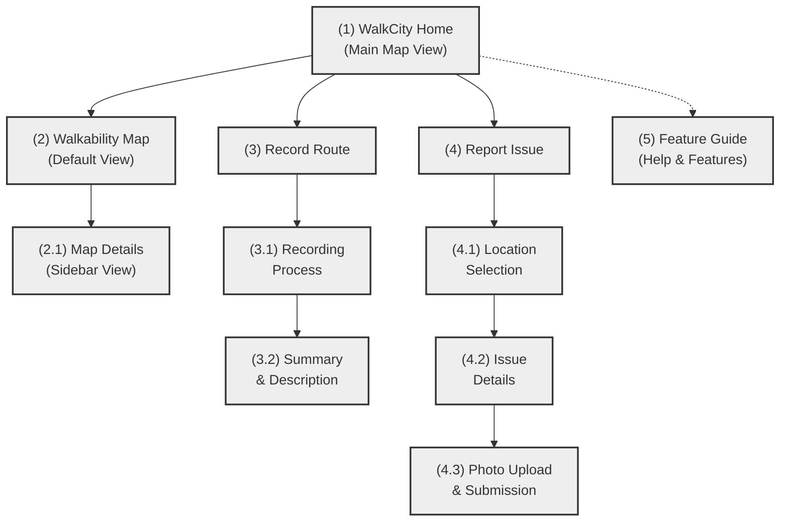

# WalkCity Application Sitemap

## Sitemap Description

The WalkCity application has the following main views:

1. **WalkCity Home (Main Map View)** - The primary entry point showing the walkability map
2. **Walkability Map (Default View)** - The default view when opening the app
   - **Map Details (Sidebar View)** - Expandable sidebar with walkability scores and filters
3. **Record Route** - Feature to record walking routes
   - **Recording Process** - Active recording with controls (start/pause/stop)
   - **Summary & Description** - Add details after recording a route
4. **Report Issue** - Three-step process for reporting walkability issues
   - **Location Selection** - Mark issue location on map
   - **Issue Details** - Select issue type and add description
   - **Photo Upload & Submission** - Add photo and submit report
5. **Feature Guide (Help & Features)** - Accessible from any screen via the Help button

This sitemap shows the hierarchical relationship between screens and the user flow through the application.
